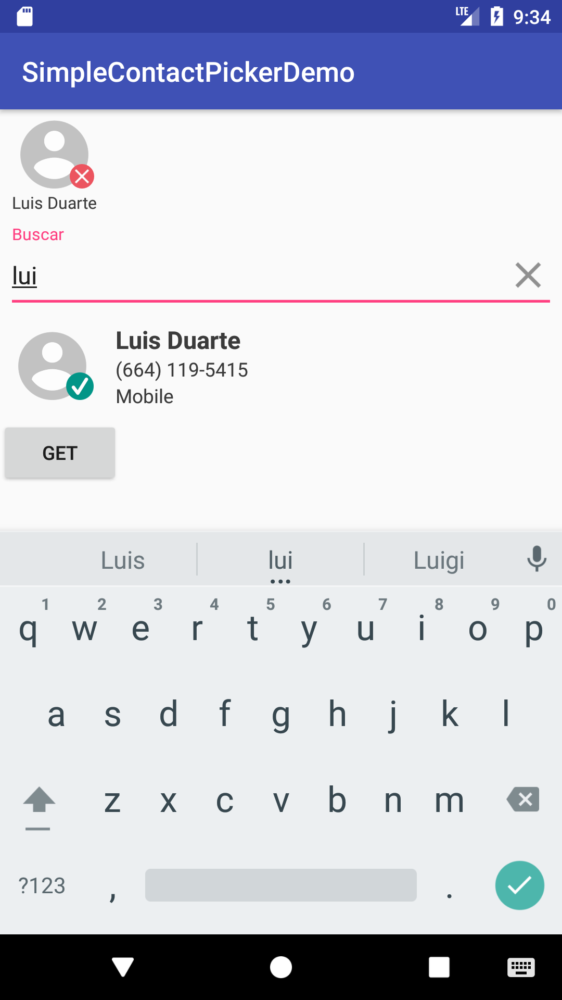
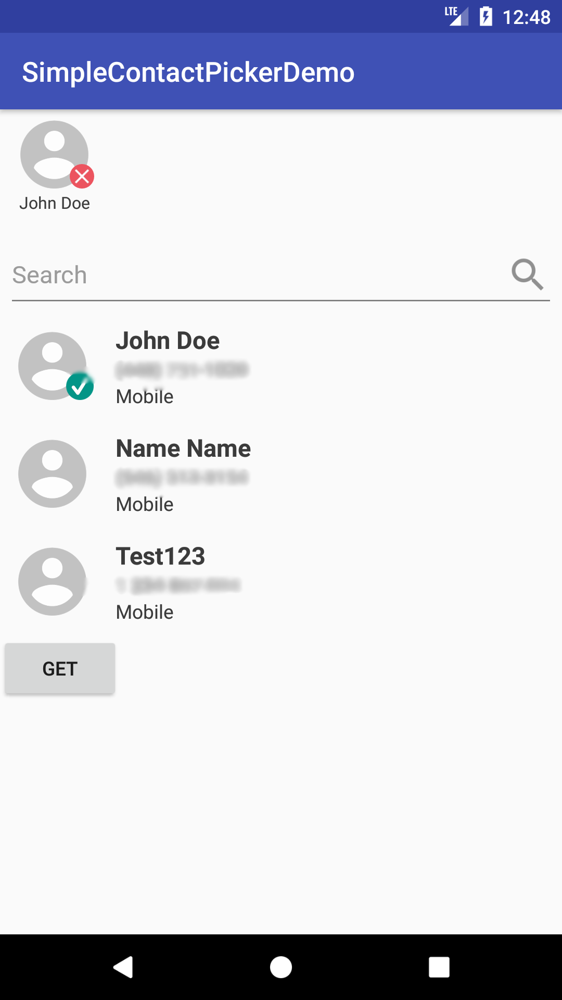
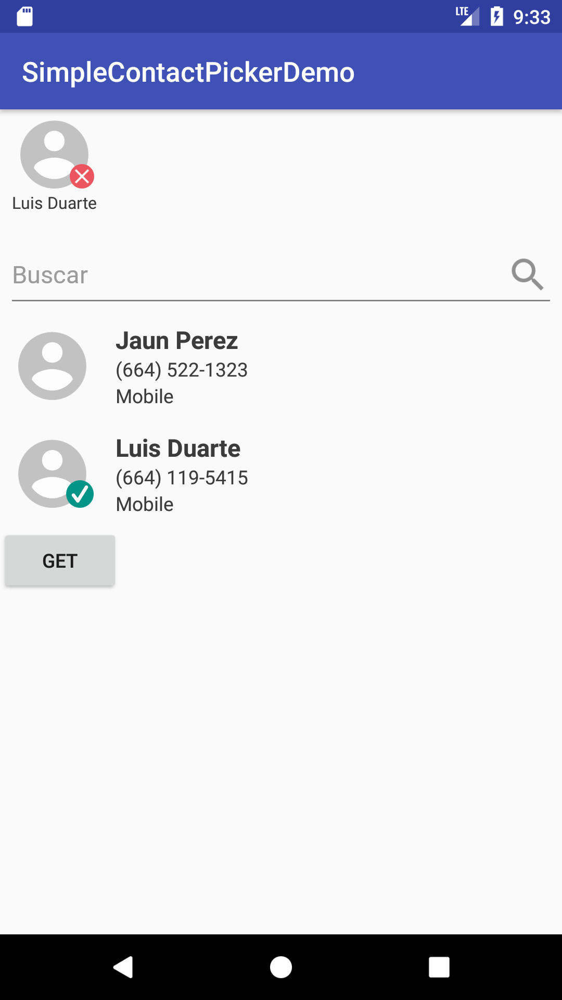

# SimpleContactPicker

SimpleContactPicker is a library that shows a view that loads and allows the user to select contacts from the android device.

### Features

- Select/deselect contacts by clicking on them
- Search through the contacts by their name or number
- Preselect contacts
- Hide contacts





### Download
1. Add the JitPack repository to your build file
 ```javascript
    allprojects {
    	repositories {
    		...
    		maven { url "https://jitpack.io" }
    	}
    }
```

2. Add the SimpleContactPicker dependency
```javascript
dependencies {
  compile 'com.github.luisdc05:SimpleContactPicker:v0.5.0'
}
```

### Basic Usage
1. Add the contact picker and picked contacts views to your layout
```xml

<com.luisdc05.simplecontactpicker.PickedContacts
     android:id="@+id/picked"
     android:layout_width="match_parent"
     android:layout_height="wrap_content" 
     />

<com.luisdc05.simplecontactpicker.SimpleContactPicker
     android:id="@+id/picker"
     android:layout_width="match_parent"
     android:layout_height="wrap_content"
    />
```

2. Attach the picked contacts view to the contact picker
```kotlin
picker.attachPickedContactsView(pickedContactsView)
```

3. When creating your activity/fragment call the loadContacts method
```kotlin
picker.loadContacts(null)
```

4. When you want to get the selected contacts call the selectedContacts property
```kotlin
picker.selectedContacts
```

#### Extra options
1. You can set a list of preselected contacts by setting the preselectedNumbers property before calling the loadContacts method
```kotlin
val selected = arrayOf("3214567845")
picker.preselectedNumbers = selected
picker.loadContacts(null)
```

2. You can also hide contacts by setting the hidden property before calling the loadContacts method
```kotlin
val hidden = arrayOf("2148794513")
picker.hidden = hidden
picker.loadContacts(null)
```

3. If you want to do something after the contacts have been loaded you can implement the OnContactsReceived interface and send it as an argument in the loadContacts function. (See example)

4. If you want to listen for each time a contact gets selected/deselected and do some logic before it gets selected to determine if the contact can be selected you can implement the ContactSelectionListener and set it to the selectionListener property. (See example)


#### Todos

- Allow for custom contacts to be injected (this can be useful if contacts come from a backend)
- Allow to use custom views for selected and listed contacts
- Allow to use a custom projection (right now it loads every type of contact)
