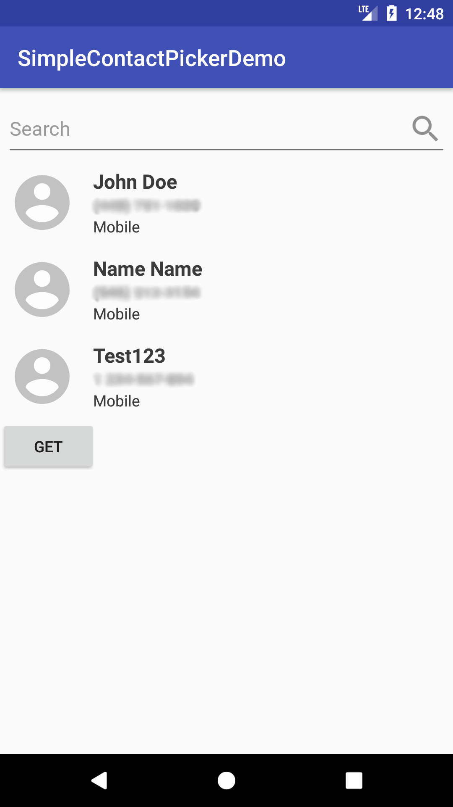
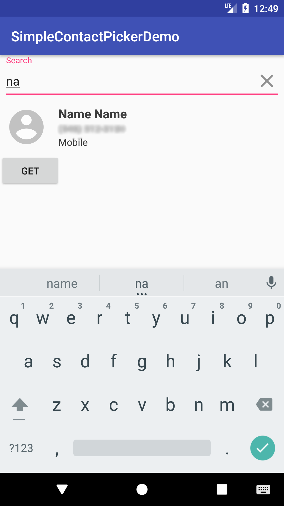

# SimpleContactPicker

SimpleContactPicker is a library that lets shows a view that loads and allows the user to select contacts from the android device.

### Features

- Select/deselect contacts by clicking on them
- Search through the contacts by their name or number
- Preselect contacts
- Hide contacts

#### Todos

- Allow for custom contacts to be injected (this can be useful if contacts come from a backend)
- Allow to use custom views for selected and listed contacts
- Allow to use a custom projection (right now it only loads mobile type contacts)
- Load the contacts on the background
